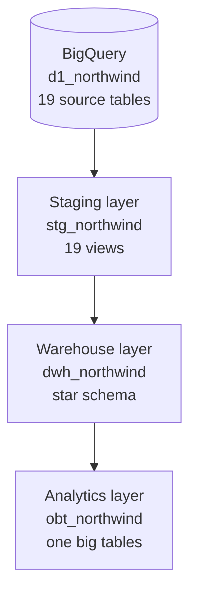

# Northwind Data Warehouse with dbt and BigQuery

A dbt project that turns the Northwind sample database (a wholesale business's orders, purchasing and inventory) into a tested, documented star schema on BigQuery, with "one big table" models on top for reporting.

> **Credit:** built while following the **Analytics Engineering Bootcamp** on Udemy by Rahul Prasad and David Badovinac. The section [Improvements I made](#improvements-i-made-after-the-course) lists what I changed and added afterwards.

## Tech stack

dbt · Google BigQuery · SQL

## Architecture



| Layer | Schema | Materialisation | Purpose |
|---|---|---|---|
| Staging | `stg_northwind` | view | One model per source table, adding an ingestion timestamp. Products with more than one supplier are filtered out here. |
| Warehouse | `dwh_northwind` | table | Kimball-style star schema: facts at a declared grain, joined to conformed dimensions. |
| Analytics | `obt_northwind` | table | Wide, pre-joined tables so analysts and BI tools can query without writing joins. |

## Data model

| Model | Type | Grain |
|---|---|---|
| `fact_sales` | Fact | One row per sales order line |
| `fact_purchase_order` | Fact | One row per purchase order line |
| `fact_inventory` | Fact | One row per inventory transaction |
| `dim_customer` | Dimension | One row per customer |
| `dim_employees` | Dimension | One row per employee |
| `dim_product` | Dimension | One row per product |
| `dim_supplier` | Dimension | One row per supplier |
| `dim_date` | Dimension | One row per day, 2005–2050, generated in SQL |

| Fact | Dimensions |
|---|---|
| `fact_sales` | customer, employee, product, date |
| `fact_purchase_order` | supplier, employee, product, date |
| `fact_inventory` | product, date |

The analytics layer has three one big tables: `obt_sales_overview`, `obt_purchase_overview` and `obt_product_inventory`.

### Why both a star schema and one big tables?

The star schema is the single source of truth: each fact is stored once at a clear grain, and dimensions are shared across facts. The one big tables trade storage for convenience. They repeat dimension attributes on every row so a dashboard can read one table with no joins, which suits BigQuery's columnar storage. Because they're built from the star schema, the two layers never disagree.

## Testing and documentation

- **Primary keys:** `unique` and `not_null` on every dimension and fact key.
- **Referential integrity:** `relationships` tests from each fact to its dimensions, including the date dimension.
- **Accepted values:** `is_weekend` can only be 0 or 1.
- **Custom tests** (`tests/`):
  - `assert_sales_quantity_positive`: flags sales lines with zero or negative quantity (set to warn; see below).
  - `assert_obt_sales_matches_fact`: the one big table has exactly as many rows as the fact table, so its joins neither add nor drop rows.
- **Documentation:** every warehouse model and key column has a description in `schema.yml`. Run `dbt docs generate && dbt docs serve` to browse the docs and lineage graph.

## Data quality findings

Adding tests surfaced two issues the original models never showed:

- **The date dimension didn't cover the data.** Every fact row failed its relationship test to `dim_date`. The calendar started in 2014, but the Northwind orders run from January to June 2006, so no fact could join to a date. I extended the calendar to start in 2005, and all date relationships now pass.
- **Two sales lines have a quantity of 0.** Both belong to order 81. They're genuine source records, so I kept them in `fact_sales` rather than silently dropping them, and the custom test flags them as a warning for review.

## Improvements I made after the course

- **Fixed the purchase order fact's grain.** It originally joined purchase orders to sales order lines on product ID alone, which attached customers to purchase orders and duplicated each purchase line once per customer who had bought that product. It is now one row per purchase order line, joined to suppliers rather than customers.
- **Added `dim_supplier`** so purchasing has a proper supplier dimension, and replaced the customer-based purchasing table with `obt_purchase_overview`.
- **Declared the grain of each fact** and deduplicated on the true primary key, ordered by the most recent date where one exists.
- **Fixed `dim_date`:** extended the calendar back to 2005 so it covers the 2006 data, corrected the inverted weekend flag, and fixed `year_day`, which returned the day of the month instead of the day of the year.
- **Cleaned the one big tables:** fixed mislabelled and duplicated columns.
- **Added the full test suite and model documentation** described above.
- **Changed staging models to views**, since they're a thin pass-through layer.

## Repository structure

```
dimensional_modelling_project/
├── dbt_project.yml
├── models/
│   ├── staging/          # 19 staging models + source.yml
│   ├── warehouse/        # facts, dimensions + schema.yml
│   └── analytics_obt/    # one big tables + schema.yml
└── tests/                # custom data tests
```

## How to run

1. Load the Northwind sample database into a BigQuery dataset named `d1_northwind`.
2. Install dbt for BigQuery:
   ```bash
   pip install dbt-bigquery
   ```
3. Add a profile called `dimensional_modelling_project1` to `~/.dbt/profiles.yml` pointing at your Google Cloud project (see the [dbt BigQuery setup guide](https://docs.getdbt.com/docs/core/connect-data-platform/bigquery-setup)).
4. From the `dimensional_modelling_project` folder, build and test everything:
   ```bash
   dbt build
   ```

## Limitations and next steps

- **Products with several suppliers are excluded** in staging, so a few products are missing from `dim_product`. The product relationship tests are set to warn rather than fail for this reason. Next step: a product–supplier bridge table.
- **Dimensions are Type 1.** Changes overwrite old values. dbt snapshots would add history (Type 2).
- **Full rebuilds.** Every model is rebuilt on each run. Incremental models would suit larger fact tables.
- **Status IDs aren't decoded.** Status lookups such as `orders_status` are staged but not yet joined into the facts as readable labels.